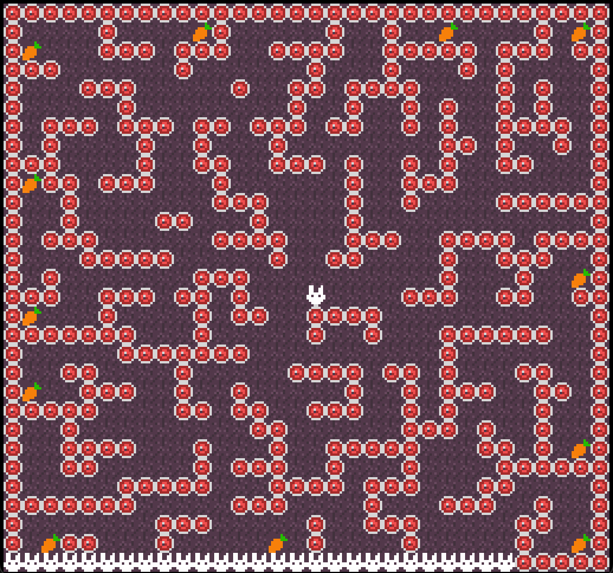

# Rabbit in the Cave

Author: Leo Chou, Wish Kuo, Wizard Hsu

Design: I'm so hungry, let me eat all the carrots!

Screen Shot:

How Your Asset Pipeline Works:

Built from asset_generator.cpp. Read ast_list.txt to process .png files in the list. PNG files will be converted to .asset files. During gameplay, the game loads .asset files to process tiles and palette via PPU.

How To Play:

Use up, down, left, right arrows to move the rabbit. Try your best to collect all the carrots! Note that if you leave the center, you will lose your sight. Press "Enter" to directly get back to the center. You will lose a rabbit every 4 seconds, and earn 3 rabbits each time you successfully collect a carrot. If you run out of the rabbits, you will be too hungry to move again!

Sources:
(TODO: list a source URL for any assets you did not create yourself. Make sure you have a license for the asset.)

This game was built with [NEST](NEST.md).
